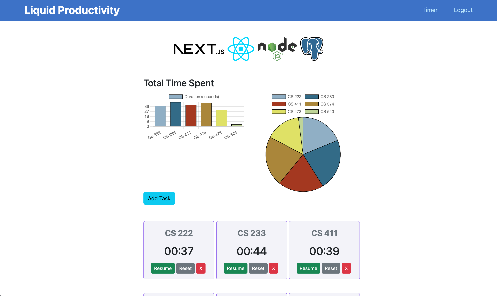
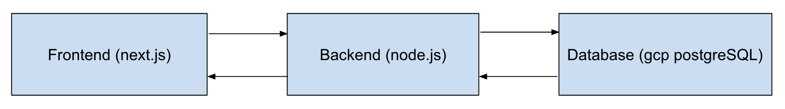

# Liquid Productivity

## What is "Liquid Productivity"?

It is a productivity time management platform that allows you to track the time you spent on various tasks, productive or not productive. Then after completing each task, the website will show the user exactly a bar-chart of how the user spent their time over their entire usage of this platform. Users can sign up for an account, then login and logout of their account. They can add, update, and delete tasks as well. 

## Technical Architecture

Frontend: react.js + next.js (framework) + jest.js (testing) \
Backend: node.js + express.js \
Database: Google Cloud Platform + PostgreSQL 

Frontend sends user and task info to Backend. \
Backend sends frontend's request to Database. \
Database sends the requested query result to backend. \
Backend sends the result from Database to Frontend. \
Frontend displays and visualizes data for users. 

## Group Members and Roles
Ziyue Yang (ziyuey6) Role: Frontend, Backend, Database \
Qiuchi Li (qiuchil2) Role: Frontend \
Jeff Fan (hfan12) Role: Backend \
Zhaoqi Xia (zhaoqix2) Role: Database 

# How to run:
1. (to git clone) \
`git clone https://github.com/CS222-UIUC/course-project-bongo.git` 

1. (if you're just trying to update) switch to your branch and fetch+merge \
`git checkout [your_branch]` \
`git fetch origin` \
`git merge origin/main` 

2. frontend install + run \
`cd nextjs` \
`npm i` \
`npx next dev`

3. server install + run \
`cd server` \
`npm i` \
`nodemon` \
then open the corresponding localhost specified 

1. how to push (create pr review) \
`git add .` \
`git commit -m"your commit message"` \
`git push` // push to your own remote branch \
`git push origin [your_branch]:main` // push from your branch to main \
then open github and open pr review to merge to main 
